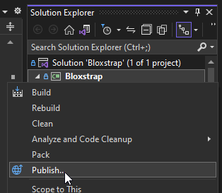
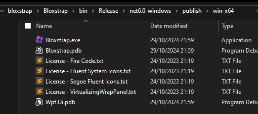

import { Tabs, TabItem } from '@astrojs/starlight/components';

:::note
The .NET 9 SDK is not yet supported. If you're having issues with building, try uninstalling it and get the [.NET 8 SDK](https://dotnet.microsoft.com/en-us/download) instead.

Also, this can only be done on Windows as this uses the .NET Desktop Runtime.
:::

First, download the source repository using either git clone or GitHub Desktop. Don't download it as a .zip archive as you'll just run into problems when you don't use git.

```sh
git clone https://github.com/bloxstraplabs/bloxstrap.git
cd bloxstrap
git submodule init 
git submodule update
```

From here, you can build using either Visual Studio, or the .NET CLI. If you don't have Visual Studio installed, use the CLI.

<Tabs>
  <TabItem label="Visual Studio" icon="vscode">
  :::note
  These instructions are for building a release binary. Otherwise, you can just use the Visual Studio debugger.
  :::

  Open Bloxstrap.sln in Visual Studio, right-click the Bloxstrap project in the Solution Explorer, and select 'Publish'. Configure your build options if you need to (defaults are fine), and click 'Publish'.

  

  
  </TabItem>
  <TabItem label=".NET CLI">
  If you don't have Visual Studio installed, you can just download and install the [.NET SDK](https://dotnet.microsoft.com/en-us/download) for this one.

   Open a Command Prompt window, and set your location to the folder containing Bloxstrap.sln. Then, run the following command:

   ```sh
   dotnet publish Bloxstrap /p:PublishProfile=Publish-x64
   ```

   If you need to configure any build options, run `dotnet help publish` to learn how to configure options for publishing.
  </TabItem>
</Tabs>

---

Go to the Bloxstrap folder (the one containing Bloxstrap.csproj), where the artifacts will be located in `bin\Release\net6.0-windows\publish\win-x64`. From there, you can either run and install it fresh, or copy it into your Bloxstrap install location.


