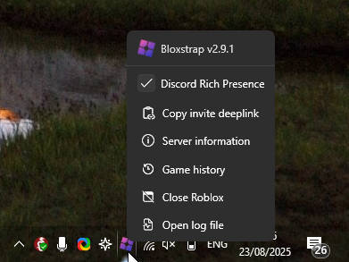

:::note
This feature requires [activity tracking](/wiki/features/activity-tracking/) to be enabled.
:::

Need to rejoin a server you were just in, but you've left it and don't know how to find it again? Or maybe you're wondering how much time you've spent in a game?

Bloxstrap keeps a local record of servers you've joined that you can easily go back to.

To get to this window, open the [activity tracker](/wiki/features/activity-tracking/) menu and choose the 'Game history' option.

As the text in the window says, this info is not stored anywhere and is only available while Roblox is open. It won't be useful if you're closing Roblox when changing to another game. 