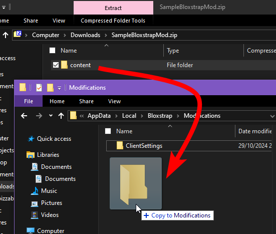
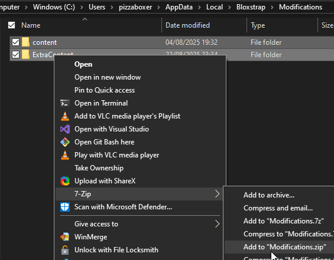

import { FileTree } from '@astrojs/starlight/components';

Bloxstrap allows for modding the Roblox client for the main purpose of customisation, though in a very limited way.

The Roblox game client stores some of its core assets locally in a folder, and they can be edited. Things like character sounds, mouse cursors, fonts, textures etc. Modding is just changing these files to be what you want. It's harmless, purely cosmetic, and any changes you make are local to you only.

You can do this without Bloxstrap, but any edits you make to the assets will be gone when Roblox updates. Doing it through Bloxstrap prevents that, and that's the key feature.

Using Bloxstrap's modding system is a little complicated, so there are presets that you can use for some common needs, like fonts and mouse cursors.

## Finding mods to use

[GameBanana](https://gamebanana.com/search?_sModelName=Mod&_sOrder=best_match&_sSearchString=bloxstrap&_idGameRow=2879) is a good place to find some. Just keep in mind that some may not work properly, since Roblox updates may break them.

Besides that, there isn't a specific place for them and they're typically shared around on a community basis.

### Importing downloaded mods

When you download a mod, you should get it in a .zip archive.

Open it, and look around until you find folders named 'content' or 'ExtraContent' or 'PlatformContent'. Then, just drag them over into the mods folder.

### Importing multiple mods

If you're importing multiple mod packs, you must extract them all into the same main mods folder. This also means that some mods can conflict with each other. Windows should tell you if that happens since it'll ask you about overwriting files when trying to import them.

Unfortunately, because of the 'one big merged folder' solution that Bloxstrap currently uses, you cannot easily remove mods selectively. You may need to either find and delete the specific files that are part of the mod, or clear everything out and start fresh.

## Making your own mods

Essentially, the mods folder (located at `Bloxstrap\Modifications\`) functions as an overlay of the Roblox client folder (located at `Bloxstrap\Versions\version-{id}\`). 

Whenever Roblox is launched, all of the Mods folder gets copied into the client folder. So, you need to put your edited files in the Mods folder in the correct places.

First off, you need to look for something to mod. Open the mods folder, then go up one folder, and go down into the Versions folder. You should end up somewhere like here:

<video controls>
    <source src="/assets/wiki/mods-navigation.webm" type="video/webm" />
</video>

Take a look around the content folders, and find something to replace. Once you have, place the modded version of the asset inside the Mods folder, while **matching the folder structure of the client folder**.

For example, replacing the death sound, which is located at `content\sounds\ouch.ogg`. With the modding system, the file placement must look something like this:

<FileTree>

- Bloxstrap
  - Modifications
    - content
      - sounds
        - **ouch.ogg** < Your version of the file
  - Versions
    - version-xxxxxxxxxxxxxxxx < Roblox client folder
      - content
        - sounds
          - ouch.ogg < Original Roblox version, keep intact

</FileTree>

You'll see that when the mods folder gets copied to the content folder, your version of the file will overwrite the original Roblox version.

The Mods folder is empty by default. You must make and name new folders in the Mods folder as needed.

### Locations of interest

| What's here | Path |
| ------ | ---- |
| Mouse cursors | `content\textures\KeyboardMouse\Cursors\` |
| Character sounds | `content\sounds\` |
| Fonts | `content\fonts\` |
| Avatar editor background | `ExtraContent\places\Mobile.rbxl` |
| Surface textures | `PlatformContent\pc\textures\` |

It should be noted that **you cannot replace individual icons**, at least not easily, since Roblox stores them in sprite sheets. Modding them is not recommended, since the locations of the icons change frequently with Roblox updates.

### Distributing mods

Mods should be distributed in a .zip archive. We recommend using [7-zip](https://www.7-zip.org/) for this.

First, ensure that only the files needed are in the mods folder, since it's easier to handle things this way. Copy the other files somewhere else temporarily (including the ClientSettings folder).

Then, select everything in the mods folder, right-click, and create a .zip archive from it.

In most cases, you're probably only zipping one folder, and that's fine. Rename the .zip archive once created.

The reason why you want to create it this way is so that the mod files are in the root of the .zip archive. That way, there's less confusion about how a user extracts the archive into the folder.