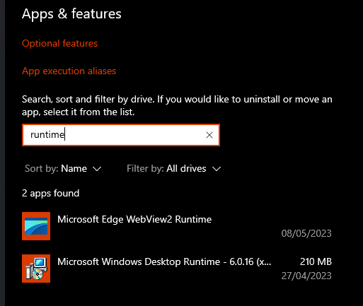

:::note
This is about Bloxstrap not opening. If your issue is about Roblox not opening, [see here](/wiki/help/roblox-crashes-or-does-not-launch/).
:::

If Bloxstrap does nothing when trying to run it (no installer, no main menu, absolutely nothing), it's likely because you have an outdated version of the .NET 6 runtime installed.

Be sure that you have the latest version installed. [Download it here.](https://aka.ms/dotnet-core-applaunch?missing_runtime=true&arch=x64&rid=win11-x64&apphost_version=6.0.20&gui=true)

