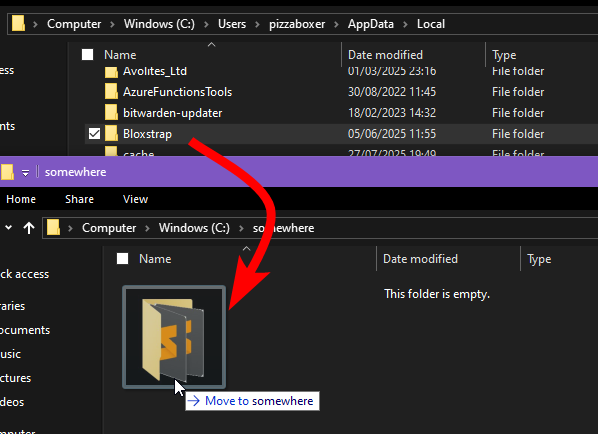
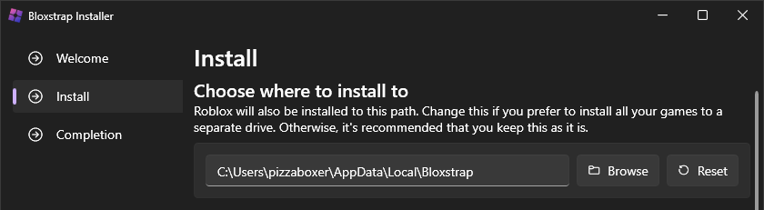

:::caution
Before you do this, make sure that Roblox and Bloxstrap are closed and not running.
:::

There are two ways of doing this.

### 1. Move the installation folder

Yeah, it's that simple. Moving the folder is all you really need to do.

By default, Bloxstrap's installation folder is at `%localappdata%\Bloxstrap` 

(expands to `C:\Users\<username>\AppData\Local\Bloxstrap`)

After you move it, you will need to open the folder, run Bloxstrap.exe, and re-enable any shortcuts you had in the settings menu. You'll also need to delete the old ones.

### 2. Reinstall Bloxstrap

When you install Bloxstrap, it gives you the option to choose where you want to install it. You're only provided this option when installing, so reinstalling will let you do this.

