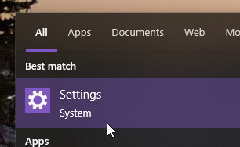
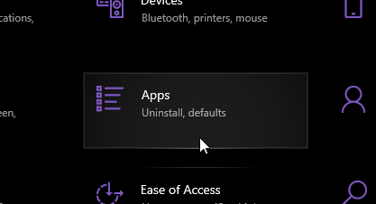
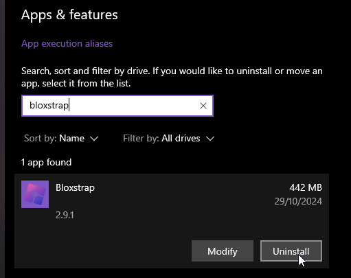

import { Steps } from '@astrojs/starlight/components';

To uninstall Bloxstrap, you uninstall it like any other program on your computer. Here's how:

<Steps>

1. Open the Settings app
   

   

2. Go to the Apps section. (On Windows 11, look in the sidebar for this)

   

3. Search for Bloxstrap, select it and click Uninstall
   
   

</Steps>